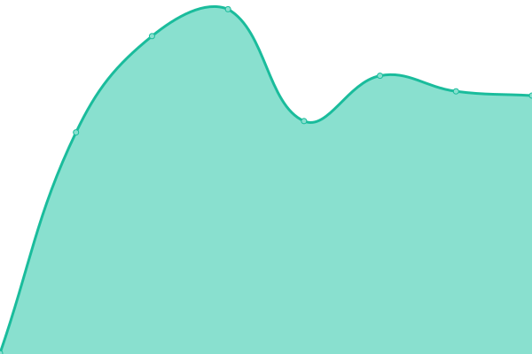

# [📈 Live Status](https://status.toshiki.top): <!--live status--> **🟩 All systems operational**

<!--start: status pages-->
<!-- This summary is generated by Upptime (https://github.com/upptime/upptime) -->
<!-- Do not edit this manually, your changes will be overwritten -->
<!-- prettier-ignore -->
| URL | Status | History | Response Time | Uptime |
| --- | ------ | ------- | ------------- | ------ |
|  [🏠 Toshiki's Homepage](https://www.toshiki.top/) | 🟩 Up | [toshiki-s-homepage.yml](https://github.com/andatoshiki/toshiki-status/commits/HEAD/history/toshiki-s-homepage.yml) | 

 378ms
     
 | 

<a href="https://status.toshiki.top/history/toshiki-s-homepage">100.00%</a>
    

|  [💨 Toshiki's AC](https://ac.toshiki.top/) | 🟩 Up | [toshiki-s-ac.yml](https://github.com/andatoshiki/toshiki-status/commits/HEAD/history/toshiki-s-ac.yml) | 

 378ms
     
 | 

<a href="https://status.toshiki.top/history/toshiki-s-ac">100.00%</a>
    

|  [🌮 Toshiki's Proxypool](https://proxypool.toshiki.top/) | 🟩 Up | [toshiki-s-proxypool.yml](https://github.com/andatoshiki/toshiki-status/commits/HEAD/history/toshiki-s-proxypool.yml) | 

 830ms
     
 | 

<a href="https://status.toshiki.top/history/toshiki-s-proxypool">100.00%</a>
    

|  [❤ Toshiki's Love Showcase](https://love.toshiki.top/) | 🟩 Up | [toshiki-s-love-showcase.yml](https://github.com/andatoshiki/toshiki-status/commits/HEAD/history/toshiki-s-love-showcase.yml) | 

 354ms
     
 | 

<a href="https://status.toshiki.top/history/toshiki-s-love-showcase">100.00%</a>
    

|  [🎏 Toshiki's Proxy Subscription](https://subweb.toshiki.top/) | 🟩 Up | [toshiki-s-proxy-subscription.yml](https://github.com/andatoshiki/toshiki-status/commits/HEAD/history/toshiki-s-proxy-subscription.yml) | 

 259ms
     
 | 

<a href="https://status.toshiki.top/history/toshiki-s-proxy-subscription">100.00%</a>
    

|  [📚 Toshiki's Comment](https://comment.toshiki.top/) | 🟩 Up | [toshiki-s-comment.yml](https://github.com/andatoshiki/toshiki-status/commits/HEAD/history/toshiki-s-comment.yml) | 

 3615ms
     
 | 

<a href="https://status.toshiki.top/history/toshiki-s-comment">100.00%</a>
    

|  [⚖ Toshiki's CDN](https://cdn.toshiki.top) | 🟩 Up | [toshiki-s-cdn.yml](https://github.com/andatoshiki/toshiki-status/commits/HEAD/history/toshiki-s-cdn.yml) | 

 480ms
     
 | 

<a href="https://status.toshiki.top/history/toshiki-s-cdn">100.00%</a>
    

|  [☁️ Toshiki's OneIndexT Stats](https://oneindext.toshiki.top/) | 🟩 Up | [toshiki-s-one-index-t-stats.yml](https://github.com/andatoshiki/toshiki-status/commits/HEAD/history/toshiki-s-one-index-t-stats.yml) | 

 328ms
     
 | 

<a href="https://status.toshiki.top/history/toshiki-s-one-index-t-stats">100.00%</a>
    

|  [🥓 Toshiki's Image Host](https://image.toshiki.top/) | 🟩 Up | [toshiki-s-image-host.yml](https://github.com/andatoshiki/toshiki-status/commits/HEAD/history/toshiki-s-image-host.yml) | 

 1005ms
     
 | 

<a href="https://status.toshiki.top/history/toshiki-s-image-host">97.12%</a>
    

|  [🍭 Toshiki's Aria2 Panel](http://aria.toshiki.top/) | 🟩 Up | [toshiki-s-aria2-panel.yml](https://github.com/andatoshiki/toshiki-status/commits/HEAD/history/toshiki-s-aria2-panel.yml) | 

 4849ms
     
 | 

<a href="https://status.toshiki.top/history/toshiki-s-aria2-panel">100.00%</a>
    

|  [🍛 LostArk Chinese Forum](https://lost-ark.top/) | 🟩 Up | [lost-ark-chinese-forum.yml](https://github.com/andatoshiki/toshiki-status/commits/HEAD/history/lost-ark-chinese-forum.yml) | 

 2705ms
     
 | 

<a href="https://status.toshiki.top/history/lost-ark-chinese-forum">99.79%</a>
    

<!--end: status pages-->
