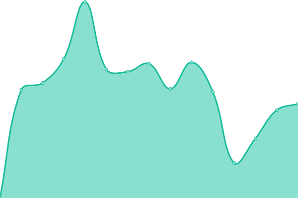

# [📈 Live Status](https://status.toshiki.top): <!--live status--> **🟧 Partial outage**

<!--start: status pages-->
<!-- This summary is generated by Upptime (https://github.com/upptime/upptime) -->
<!-- Do not edit this manually, your changes will be overwritten -->
<!-- prettier-ignore -->
| URL | Status | History | Response Time | Uptime |
| --- | ------ | ------- | ------------- | ------ |
|  [🏠 Toshiki's Homepage](https://www.toshiki.top/) | 🟩 Up | [toshiki-s-homepage.yml](https://github.com/andatoshiki/toshiki-status/commits/HEAD/history/toshiki-s-homepage.yml) | 

 396ms
     
 | 

<a href="https://status.toshiki.top/history/toshiki-s-homepage">100.00%</a>
    

|  [💨 Toshiki's AC](https://ac.toshiki.top/) | 🟩 Up | [toshiki-s-ac.yml](https://github.com/andatoshiki/toshiki-status/commits/HEAD/history/toshiki-s-ac.yml) | 

 1047ms
     
 | 

<a href="https://status.toshiki.top/history/toshiki-s-ac">100.00%</a>
    

|  [💫 Toshiki's CDN](https://cdn.toshiki.top/) | 🟥 Down | [toshiki-s-cdn.yml](https://github.com/andatoshiki/toshiki-status/commits/HEAD/history/toshiki-s-cdn.yml) | 

 723ms
     
 | 

<a href="https://status.toshiki.top/history/toshiki-s-cdn">0.00%</a>
    

|  [🧥 LostArk Chinese Forum](https://lost-ark.top/) | 🟥 Down | [lost-ark-chinese-forum.yml](https://github.com/andatoshiki/toshiki-status/commits/HEAD/history/lost-ark-chinese-forum.yml) | 

 1804ms
     
 | 

<a href="https://status.toshiki.top/history/lost-ark-chinese-forum">99.99%</a>
    

<!--end: status pages-->
