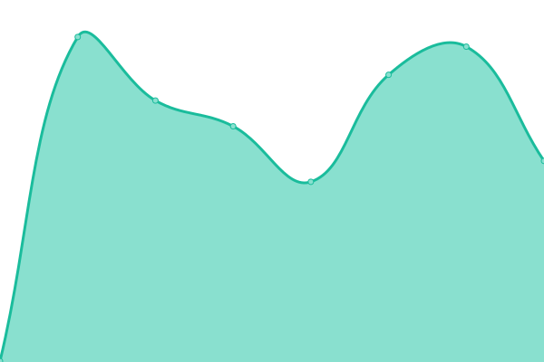

# [📈 Live Status](https://status.toshiki.top): <!--live status--> **🟧 Partial outage**

<!--start: status pages-->
<!-- This summary is generated by Upptime (https://github.com/upptime/upptime) -->
<!-- Do not edit this manually, your changes will be overwritten -->
<!-- prettier-ignore -->
| URL | Status | History | Response Time | Uptime |
| --- | ------ | ------- | ------------- | ------ |
|  [Toshiki's Homepage](https://www.toshiki.top) | 🟩 Up | [toshiki-s-homepage.yml](https://github.com/andatoshiki/toshiki-status/commits/HEAD/history/toshiki-s-homepage.yml) | 

 403ms
     
 | 

<a href="https://status.toshiki.top/history/toshiki-s-homepage">100.00%</a>
    

|  [Wikipedia](https://en.wikipedia.org) | 🟥 Down | [wikipedia.yml](https://github.com/andatoshiki/toshiki-status/commits/HEAD/history/wikipedia.yml) | 

 258ms
     
 | 

<a href="https://status.toshiki.top/history/wikipedia">100.00%</a>
    

|  [Hacker News](https://news.ycombinator.com) | 🟩 Up | [hacker-news.yml](https://github.com/andatoshiki/toshiki-status/commits/HEAD/history/hacker-news.yml) | 

 356ms
     
 | 

<a href="https://status.toshiki.top/history/hacker-news">100.00%</a>
    

|  [Test Broken Site](https://thissitedoesnotexist.koj.co) | 🟥 Down | [test-broken-site.yml](https://github.com/andatoshiki/toshiki-status/commits/HEAD/history/test-broken-site.yml) | 

 0ms
     
 | 

<a href="https://status.toshiki.top/history/test-broken-site">100.00%</a>
    

<!--end: status pages-->
