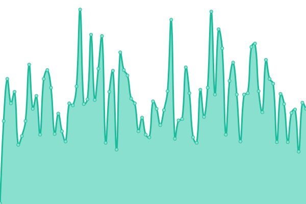
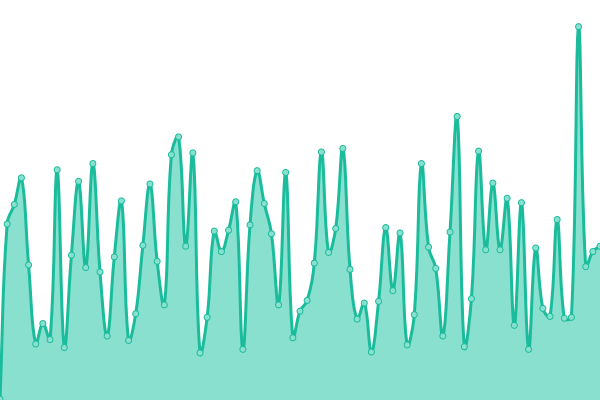

# [📈 Live Status](https://status.toshiki.top): <!--live status--> **🟧 Partial outage**

<!--start: status pages-->
<!-- This summary is generated by Upptime (https://github.com/upptime/upptime) -->
<!-- Do not edit this manually, your changes will be overwritten -->
<!-- prettier-ignore -->
| URL | Status | History | Response Time | Uptime |
| --- | ------ | ------- | ------------- | ------ |
|  [🠠Toshiki's Homepage](https://www.toshiki.top/) | 🟥 Down | [toshiki-s-homepage.yml](https://github.com/andatoshiki/toshiki-status/commits/HEAD/history/toshiki-s-homepage.yml) | 

 0ms
     
 | 

<a href="https://status.toshiki.top/history/toshiki-s-homepage">0.00%</a>
    

|  [💨 Toshiki's AC](https://ac.toshiki.top/) | 🟥 Down | [toshiki-s-ac.yml](https://github.com/andatoshiki/toshiki-status/commits/HEAD/history/toshiki-s-ac.yml) | 

 0ms
     
 | 

<a href="https://status.toshiki.top/history/toshiki-s-ac">0.00%</a>
    

|  [🌮 Toshiki's Proxypool](https://proxypool.toshiki.top/) | 🟥 Down | [toshiki-s-proxypool.yml](https://github.com/andatoshiki/toshiki-status/commits/HEAD/history/toshiki-s-proxypool.yml) | 

 0ms
     
 | 

<a href="https://status.toshiki.top/history/toshiki-s-proxypool">100.00%</a>
    

|  [🎏 Toshiki's Proxy Subscription](https://subweb.toshiki.top/) | 🟥 Down | [toshiki-s-proxy-subscription.yml](https://github.com/andatoshiki/toshiki-status/commits/HEAD/history/toshiki-s-proxy-subscription.yml) | 

 0ms
     
 | 

<a href="https://status.toshiki.top/history/toshiki-s-proxy-subscription">0.00%</a>
    

|  [📚 Toshiki's Comment](https://comment.toshiki.top/) | 🟥 Down | [toshiki-s-comment.yml](https://github.com/andatoshiki/toshiki-status/commits/HEAD/history/toshiki-s-comment.yml) | 

 0ms
     
 | 

<a href="https://status.toshiki.top/history/toshiki-s-comment">100.00%</a>
    

|  [☁️ Toshiki's OneIndexT Stats](https://oneindext.toshiki.top/) | 🟥 Down | [toshiki-s-one-index-t-stats.yml](https://github.com/andatoshiki/toshiki-status/commits/HEAD/history/toshiki-s-one-index-t-stats.yml) | 

 0ms
     
 | 

<a href="https://status.toshiki.top/history/toshiki-s-one-index-t-stats">100.00%</a>
    

|  [🥓 Toshiki's Image Host](https://image.toshiki.top/) | 🟥 Down | [toshiki-s-image-host.yml](https://github.com/andatoshiki/toshiki-status/commits/HEAD/history/toshiki-s-image-host.yml) | 

 0ms
     
 | 

<a href="https://status.toshiki.top/history/toshiki-s-image-host">100.00%</a>
    

|  [🭠Toshiki's Aria2 Panel](http://download.toshiki.top/) | 🟥 Down | [toshiki-s-aria2-panel.yml](https://github.com/andatoshiki/toshiki-status/commits/HEAD/history/toshiki-s-aria2-panel.yml) | 

 0ms
     
 | 

<a href="https://status.toshiki.top/history/toshiki-s-aria2-panel">100.00%</a>
    

|  [🛠LostArk Chinese Forum](https://lost-ark.top/) | 🟥 Down | [lost-ark-chinese-forum.yml](https://github.com/andatoshiki/toshiki-status/commits/HEAD/history/lost-ark-chinese-forum.yml) | 

 0ms
     
 | 

<a href="https://status.toshiki.top/history/lost-ark-chinese-forum">100.00%</a>
    

|  [🠠Toshiki's Gallery](https://gallery.toshiki.top/) | 🟥 Down | [toshiki-s-gallery.yml](https://github.com/andatoshiki/toshiki-status/commits/HEAD/history/toshiki-s-gallery.yml) | 

 0ms
     
 | 

<a href="https://status.toshiki.top/history/toshiki-s-gallery">0.00%</a>
    

|  [🩠Toshiki's Navigation](https://nav.toshiki.top/) | 🟥 Down | [toshiki-s-navigation.yml](https://github.com/andatoshiki/toshiki-status/commits/HEAD/history/toshiki-s-navigation.yml) | 

 0ms
     
 | 

<a href="https://status.toshiki.top/history/toshiki-s-navigation">0.00%</a>
    

|  [🻠Toshiki's R2 Storage](https://r2.toshiki.dev/) | 🟥 Down | [toshiki-s-r2-storage.yml](https://github.com/andatoshiki/toshiki-status/commits/HEAD/history/toshiki-s-r2-storage.yml) | 

 490ms
     
 | 

<a href="https://status.toshiki.top/history/toshiki-s-r2-storage">100.00%</a>
    

|  [🗠Toshiki's R2 Storage-bak](https://r2.toshiki.top/) | 🟥 Down | [toshiki-s-r2-storage-bak.yml](https://github.com/andatoshiki/toshiki-status/commits/HEAD/history/toshiki-s-r2-storage-bak.yml) | 

 0ms
     
 | 

<a href="https://status.toshiki.top/history/toshiki-s-r2-storage-bak">100.00%</a>
    

|  [🶠Toshiki's Coverview](https://coverview.toshiki.dev/) | 🟩 Up | [toshiki-s-coverview.yml](https://github.com/andatoshiki/toshiki-status/commits/HEAD/history/toshiki-s-coverview.yml) | 

 142ms
     
 | 

<a href="https://status.toshiki.top/history/toshiki-s-coverview">100.00%</a>
    

|  [🶠Toshiki's Coverview-bak](https://coverview.toshiki.top/) | 🟥 Down | [toshiki-s-coverview-bak.yml](https://github.com/andatoshiki/toshiki-status/commits/HEAD/history/toshiki-s-coverview-bak.yml) | 

 0ms
     
 | 

<a href="https://status.toshiki.top/history/toshiki-s-coverview-bak">0.00%</a>
    

<!--end: status pages-->
